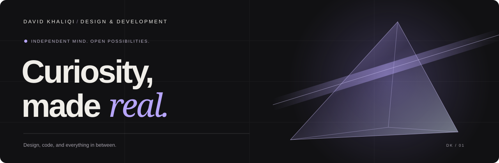

  

  <a href="https://kletterrn.github.io/"><strong>Explore my portfolio ↗</strong></a>
  &nbsp; · &nbsp;
  <a href="https://www.linkedin.com/in/david-khaliqi0">LinkedIn</a>
  &nbsp; · &nbsp;
  <a href="mailto:davidkhaliqi05@gmail.com">Say hello</a>

 

## A good eye. A curious mind.

I’m **David**, a state-certified media assistant based in Germany. I started with how things look. Now I’m just as interested in how they work.

My projects bring together **visual design, software development, and hands-on experimentation** — from making satellite data readable to building interfaces inside a game. I like following an idea all the way from the first sketch to something you can actually use.

> **My next chapter:** an application development apprenticeship starting in **2027**.  
> Currently working toward the **Google Cybersecurity Professional Certificate**.

 

## Ideas in practice

### 01 &nbsp; / &nbsp; Project Ignis
**Satellite observations. Human-readable.**

An approachable map for exploring NASA FIRMS observations. A project at the intersection of data, APIs, and interface design — turning raw information into something easier to understand.

`Python` `Flask` `JavaScript` `API integration`

[Explore the code ↗](https://github.com/kletterrn/Ignis) &nbsp; · &nbsp; [Project story ↗](https://kletterrn.github.io/work/ignis/)

---

### 02 &nbsp; / &nbsp; Project Orion
**From geometry to game systems.**

An ongoing Arma Reforger mod exploring aircraft assets, camera controls, reconnaissance HUDs, and mission-map interaction. Editable sources and reproducible builds make the work easier to inspect and develop.

`Arma Reforger` `3D assets` `HUD & interaction` `Build tooling`

[Explore the code ↗](https://github.com/kletterrn/orion-recon-drone) &nbsp; · &nbsp; [Project story ↗](https://kletterrn.github.io/work/orion/) &nbsp; · &nbsp; **In development**

---

### 03 &nbsp; / &nbsp; Better Schooling
**Find the gap. Support the next step.**

An AI-assisted education prototype that helps teachers investigate prerequisite learning gaps, create targeted teaching materials, and collaborate. Includes an API-free demo, editable resources, and PDF export.

`TypeScript` `Python` `FastAPI` `SQL` `AI integration`

[Explore the code ↗](https://github.com/kletterrn/Better-Schooling-Hackathon) &nbsp; · &nbsp; **Hackathon prototype**

 

## A mix of perspectives

| Design for people | Build with data | Keep exploring |
| :--- | :--- | :--- |
| HTML & CSS | Python & Flask | Game interfaces |
| Responsive layouts | JavaScript & TypeScript | 3D assets |
| Visual design | SQL & APIs | Interaction design |
| WordPress | FastAPI | Cybersecurity fundamentals |

 

## Good ideas. Better together.

I’m looking for a place to keep learning, contribute, and grow as an application developer. If that sounds like your team — or you’d like to talk about a project — I’d love to hear from you.

**[Visit my portfolio ↗](https://kletterrn.github.io/)** &nbsp; · &nbsp; **[View my CV ↗](https://kletterrn.github.io/cv/)**  
[davidkhaliqi05@gmail.com](mailto:davidkhaliqi05@gmail.com)

 

DESIGN THINKING &nbsp; / &nbsp; DEVELOPER CURIOSITY A work in progress. Just like me.

